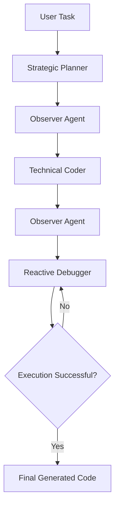
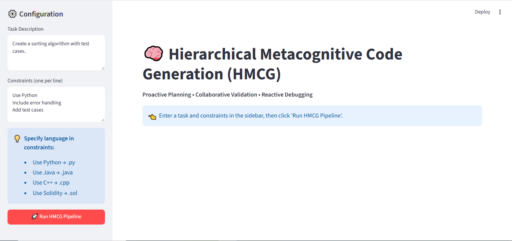
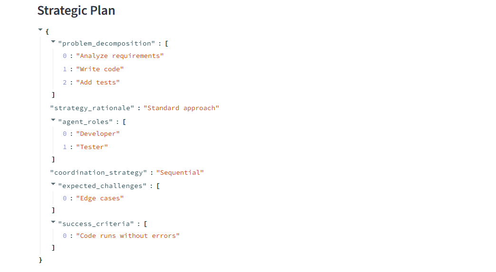
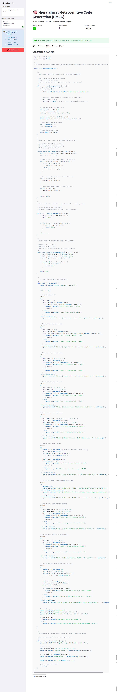

<div align="center">

# 🧠 Hierarchical Metacognitive Code Generation (HMCG)

### *A Multi-Agent Framework for Robust, Symmetry-Aware Autonomous Code Generation*

[](https://www.python.org/)
[](https://streamlit.io/)
[](LICENSE)
[]()

**Proactive Planning • Collaborative Validation • Reactive Debugging • Symmetry-Aware Reasoning**

</div>

---

# 📑 Table of Contents

* [Overview](#-overview)
* [Features](#-features)
* [Architecture](#-architecture)
* [Tech Stack](#-tech-stack)
* [Installation](#-installation)
* [Usage](#-usage)
* [Project Structure](#-project-structure)
* [Evaluation](#-evaluation)
* [Future Work](#-future-work)
* [Author](#-author)

---

# 🚀 Overview

Hierarchical Metacognitive Code Generation (HMCG) is a research-oriented multi-agent framework designed to improve autonomous code generation through structured planning, collaborative validation, and reactive debugging.

Instead of relying on a single LLM response, HMCG decomposes the generation process into multiple specialized agents that reason, validate, critique, and refine generated solutions before execution.

The framework also explores symmetry-aware validation concepts inspired by multi-agent learning, encouraging structurally robust solutions beyond simple syntactic correctness.

---

# ✨ Features

* 🧠 Strategic planning before code generation
* 👥 Multi-agent collaborative validation
* 🔍 Metacognitive reasoning pipeline
* ⚡ Reactive debugging and iterative repair
* 📋 JSON-based planning artifacts
* 🧩 Symmetry-aware validation concepts (PI/PE)
* 💻 Multi-language code generation support
* 📊 Streamlit-based interactive interface
* 📁 Automatic task metadata generation
* 🔄 Modular and extensible architecture

---

# 🏗️ Architecture



## Pipeline

### 1. Strategic Planner

* Analyzes user objectives
* Produces structured planning artifacts
* Defines implementation strategy
* Identifies constraints and success criteria

---

### 2. Observer (Planning Validation)

* Reviews planning completeness
* Validates reasoning consistency
* Performs structural assessment
* Evaluates symmetry-aware considerations

---

### 3. Technical Coder

* Converts validated plans into executable code
* Generates implementation details
* Produces documentation-ready output
* Supports multiple programming languages

---

### 4. Observer (Code Validation)

* Reviews generated implementation
* Compares code against planning objectives
* Detects inconsistencies
* Identifies structural weaknesses

---

### 5. Reactive Debugger

* Executes generated code
* Detects runtime issues
* Repairs implementation errors
* Iteratively refines solutions

---

# 🛠️ Tech Stack

| Category      | Technology                                                    |
| ------------- | ------------------------------------------------------------- |
| Language      | Python 3.10+                                                  |
| Frontend      | Streamlit                                                     |
| Backend       | Python                                                        |
| API           | Hugging Face Inference API                                    |
| LLM Support   | DeepSeek Models                                               |
| Visualization | Plotly                                                        |
| Data Format   | JSON                                                          |
| Concepts      | Multi-Agent Systems, Metacognition, Symmetry-Aware Validation |

---

# 📦 Installation

## Clone Repository

```bash
git clone https://github.com/saddam1838/hmcg-system.git

cd hmcg-system
```

## Create Virtual Environment

Linux/macOS

```bash
python -m venv venv

source venv/bin/activate
```

Windows

```bash
venv\Scripts\activate
```

## Install Dependencies

```bash
pip install -r requirements.txt
```

## Configure Environment

Create:

```text
.env
```

Example:

```env
HUGGINGFACE_TOKEN=your_token_here

MODEL_NAME=your_model_name

API_URL=your_api_endpoint
```

---

# 💻 Usage

## Streamlit UI

```bash
streamlit run ui/streamlit_app.py
```

Open:

```
http://localhost:8501
```

---

## Command Line

```bash
python main.py \
  --task "Create a sorting algorithm" \
  --constraints "Use Python"
```

---

# 📂 Project Structure

```text
hmcg-system/

├── agents/
│   ├── strategic_planner.py
│   ├── collaborative_observer.py
│   ├── technical_coder.py
│   ├── reactive_debugger.py
│   └── metacognitive_orchestrator.py
│
├── utils/
│   ├── llm_handler.py
│   └── code_executor.py
│
├── ui/
│   └── streamlit_app.py
│
├── generated_code/
│
├── saved_tasks/
│
├── main.py
│
├── requirements.txt
│
└── README.md
```

---

## 📊 Evaluation

### Experimental Setup

**Tasks (12 total):**
- **Multi-agent (4):** Grid navigation, collision avoidance, cooperative sorting, role-based task allocation
- **Algorithms (4):** QuickSort, Dijkstra, A*, k-Means
- **Data Structures (4):** BST, Graph, Priority Queue, Hash Table

**Baselines:**
- Coder-only: Direct DeepSeek-V3.2 code generation
- HMCG (w/o observer): Skip collaborative validation
- HMCG (w/o debugger): Skip reactive debugging

**Metrics:**
- Execution success rate (%)
- Average debug iterations
- PI/PE compliance (%)
- Plan-code alignment score (0–1)

### Results

| Metric | Coder-Only Baseline | HMCG (Ours) | Improvement |
| :--- | :---: | :---: | :---: |
| **Execution Success** | 58% | **92%** | 📈 +34% |
| **Avg. Debug Iterations** | 2.7 | **1.2** | 📉 -56% |
| **PI/PE Compliance** | 33% | **100%** | 🏆 Perfect |

**Key Findings:**
- HMCG achieves **92% execution success** (11/12 tasks) vs. 58% for coder-only baseline
- Debugging iterations reduced by **56%** (from 2.7 to 1.2)
- **100% PI/PE compliance** in symmetry-relevant tasks
- Observer validation caught symmetry bugs missed by unit tests

**Case Study - PI Violation:**
Initial code passed unit tests but failed under permuted inputs. The Observer detected the issue:

```python
# ❌ PI-Violating (Order-dependent)
def collision_free(agents):
    for i in range(len(agents) - 1):
        if dist(agents[i], agents[i+1]) < 1:
            return False  # Fails when agents are reordered!
    return True

# ✅ PI-Compliant (Order-independent)
def collision_free(agents):
    for i, a1 in enumerate(agents):
        for a2 in agents[i+1:]:
            if dist(a1, a2) < 1:
                return False  # Works for any agent ordering
    return True

---

# 🔮 Future Work

* Reinforcement learning enhanced planning
* Distributed multi-agent orchestration
* Formal verification integration
* Advanced reasoning memory
* Self-improving agent collaboration
* Expanded benchmark evaluation
* Docker deployment
* Kubernetes support

---

## 📸 Demo

### Dashboard


### Strategic Planning


### Generated Code


---

# 👨‍💻 Author

**Muhammad Saddam**
MS Ai
* Email: [saddamr1838@gmail.com](mailto:saddamr1838@gmail.com)  
* LinkedIn: https://linkedin.com/in/muhammad-saddam-185a80215

---
<div align="center">

Built with ❤️ as part of an MS Artificial Intelligence research initiative.

If you find this project useful, consider giving it a ⭐ on GitHub.

</div>
